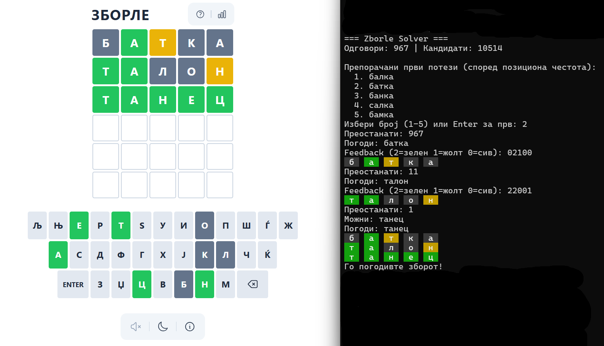

# zborle-solver

An entropy-based solver for [Zborle](https://zborle.mk), the Macedonian Wordle variant. It generates 5-letter word candidates from a corpus, ranks guesses by expected information gain, and runs an interactive terminal session with a color-coded board.

## Features

- **Candidate generation** — rule-based filtering from a raw Macedonian word corpus (`generator.py`)
- **Entropy-driven guessing** — selects the guess that minimises expected posterior entropy over remaining candidates
- **Position-frequency heuristics** — suggests strong opening words before your first guess
- **Rich terminal UI** — colour-coded board (green / yellow / gray) rendered with `rich`
- **Batch simulation** — harness for evaluating solver performance across the full answer set

## Requirements

- Python 3.8+
- Dependencies listed in `requirements.txt`

## Installation

```bash
git clone https://github.com/syreone/zborle-solver.git
cd zborle-solver
python -m venv .venv

# Activate (choose your shell)
source .venv/bin/activate          # macOS / Linux
.venv\Scripts\activate             # Windows cmd
.\.venv\Scripts\Activate.ps1       # PowerShell

pip install -r requirements.txt
```

## Usage

### 1. Build the candidate list

Skip this step if `candidates.txt` already exists.

```bash
python cli_build.py --corpus words-mk-main/all --out candidates.txt
```

### 2. Run the interactive solver

```bash
python solver.py interactive --answers words-mk-main/all --candidates candidates.txt --force-color
```

### Solver workflow

1. The solver suggests up to 5 opening words ranked by positional letter frequency.
2. Enter the number of your chosen word (1–5) or press **Enter** to accept the top suggestion.
3. Play the word on [zborle.mk](https://zborle.mk), then enter the feedback as five digits:

```text
Example: 22001  (2=green, 1=yellow, 0=gray)
```

### Example screenshot

Below is an example screenshot showing the web version side-by-side with the
terminal board produced by this solver.

